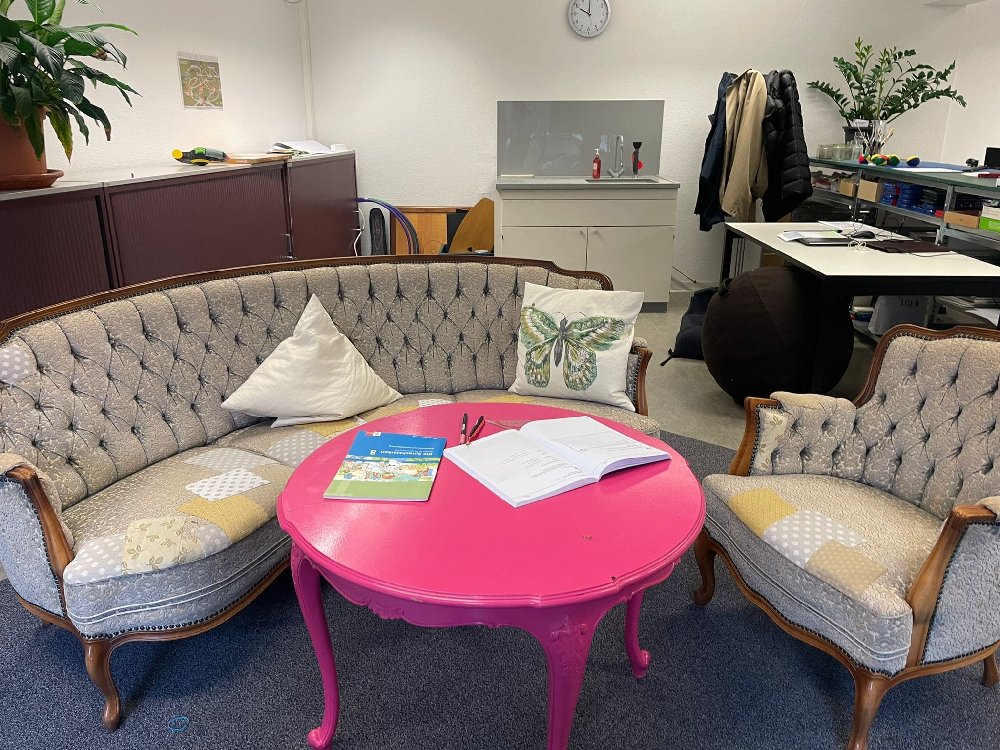

+++
title = "Begleitung von Menschen im Autismus-Spektrum"
date = "2023-03-20"
draft = false
pinned = false
+++


Roman Roner arbeitet bei Autismumuslink. Einer Schule für Jugendliche im Autismus-Spektrum. Der Schwerpunk liegt auf der Gestaltung des Sportunterrichts und den Auswirkungen von Sport auf Menschen im Autismus-Spektrum.



**Sie arbeiten mit betroffenen Menschen und was macht dieses Menschen besonders und warum arbeiten sie gerne mit ihnen zusammen?**  

Für mich spielt es keine Rolle, ob sie eine Diagnose haben oder nicht. Ich denke wir sind alle sehr verschieden und haben spezielle Eigenschaften. Innerhalb von der Diagnose, gibt es viele Unterschiede. Jede Person hat andere Fähigkeiten oder Schwierigkeiten und das ist der Aspekt, der für mich spannend ist. Der zweite Teil der Frage, wieso ich es gerne mache und hier bin, ist weil mein Schwager auch auf dem Spektrum ist, durch das wurde ich auf dieses Thema aufmerksam. Für mich ist es ein schönes Erlebnis in einem Umfeld zu arbeiten, wo ich individuell auf die Menschen eingehen kann.  

«*Für mich ist es ein schönes Erlebnis in einem Umfeld zu arbeiten, wo ich individuell auf die Menschen eingehen kann*«.

**Was sind Herausforderungen im Alltag mit Menschen auf dem Autismus Spektrum?** 

Die Herausforderungen entstehen bei Aufträgen, die wir geben. Sie müssen sehr genau sein und nicht zu viel auf einmal enthalten. Offenen Fragen sind oft sehr schwierig deshalb fragen wir mehr spezifische Fragen. Obwohl ich schon für 5 Jahren mit den jugendlichen arbeite, muss ich mich auch immer wieder an diese Kriterien erinnern. Ausserhalb der Unterrichtzeit passieren Ereignisse, wodurch sie schon mit einer schlechten Stimmung in die schule kommen. Zum Beispiel wenn jemand in einem vollen Zug für die hinreisen sitzen muss kann das viele Emotionen auslösen und die Reize überflutet. Wir haben auch Leute, die nicht aus dem Haus kommen oder dem Weg in die Schule nicht schaffen wegen dem Reizen.  Wir versuchen unserer Schuler*innen zu herausfordern und schauen, dass wie in unserer Schule nicht in einer «Bubble» leben. Damit ihr Spektrum breiter wird und sie auch andere Lösung ansetze akzeptieren können. Typische Symptome sind die soziale Interaktionen. Hier hatten viele auch schon Depressionen, Traumas und sich zu davon abgrenzen, wenn eine Person anfangt zu erzählt ist für Sie besondere schwierig.  

**Welche Menschen begleiten sie bei Autismuslink und wie sieht ein typischer Arbeitsalltag aus?**  

Wir haben ca. 17 Oberstufen Schuler\*innen von 12-18 Jahre. Ein typischer Alltag ist bei uns an einen fixen Stundenplan gerichtet. Wir beginnen um 9 Uhr. Am Morgen haben wir 3 Fächern und dann um 12 Uhr Mittagspause. Wenn am Nachmittag Schule ist, ist es von 1 bis 4. Während den Stunden, haben wir mindestens 3 Lehrpersonen da. Somit haben wir eine gute Betretung. Im Unterricht teilen wir die Klasse in kleinere Gruppen damit sie einander helfen können. Im Math arbeiten sie meistens individuell, weil es in diesem Fach einfach ist sie allein arbeiten zu lassen. Es kann auch passieren das Jemand heulen muss, weil Sie die Aufgabe nicht lösen können. Dann müssen wir diese Person aus dem Unterricht nehmen und versuchen rauszufinden was der Grund ist für das Heulen. Das kann die Aufgabe sein, die zu wenig klargestellt ist oder ein anderer persönlicher Grund. Es braucht viel Geduld das man auch dahinter sehen kann, was genau die Schwierigkeit ist. Nach dem Gespräch probieren wir mit dem Schuler\*innen wieder ein Weg zu finden in das Lernen einzutauchen. 



Autismuslink ist eine Schule für Jugendliche im Autismus-Spektrum. Die Schule unterrichtet nach den Grundlagen des Lehrnplans 21. Das Ziel ist es, die Schüler*innen individuell vorzuberiten, damit sie im Arbeitsmarkt Fuss fassen können.



**Wie muss der Sportunterricht für Menschen auf dem Spektrum gestaltet sein? Was muss man da beachten?** 

Die meisten Schuler*innen bei uns treiben kein normaler Sportunterricht da der Sport das erste ist, für was man dispension wird. Im Sportunterricht passiert sehr viel somit kommt schnell eine Reizüberflutung. Wir gestallten den Sportunterricht so, da wir keine Halle haben, haben wir Jogamatten gekauft. Darauf machen wir Kraft Übungen oder gestalten ein Posten lauf mit ihnen. Wenn schönes Wetter ist, können wir raus gehen, um zu laufen oder Ping Pong spielen. Meistens ist Ping Pong sehr praktischer im Vergleich zu einem Sport wie z.B Fussball da man sich nicht so viel bewegen muss und man nicht so viel schwitzt. Beim Schwitzen ist das Problem, das man den Schweiss abduschen muss und da entstehen so viele Probleme, dass das ganze sehr schwierig macht. Wir versuchen möglichst viele Reize aus dem Sportunterricht zu entfernen. Beim Sportunterricht sind wir noch voll im Entwickeln was wir mit welchem/welcher Schüler/Schülerin machen können.  



Roman Roner ist Schulleiter der Schule Autismuslink und arbeitet seit 5 Jahren mit den Jugendlichen. Da sein Schwager im Autismus-Spektrum ist wurde er auf das Thema aufmekrsam und interesierte sich dafür. Die Arbeit bei Autismuslink ist für ihn schön, da er individuell auf die Schüller*innen eingehen kann und ihnen somit eine Unterstützungsmöglichkeit bietet.



**Wir haben in einer Studie der Uni-Basel gelesen das Kinder im Autismus Spektrum den Sport machen besser schlafen. Da Menschen im Autismus Spektrum oft Schlafstörungen haben ist das toll. Wie beurteilen sie das?**   

Ich würde sagen das grundsätzlich, wenn man Sport macht, kann man besser schlafen ausser es wird zu viel Sport gemacht. Für mich ist das logisch, aber gleichzeitig ist es wirklich, so dass wir viele haben die nicht gut schlafen und das kann verschiedene gründe haben. Zum Beispiel ist das Körper Gefühl weniger aus geprägt somit können sie die Decke nicht «fühlen» und bekommen kein gemütliches Gefühl. Die Frage ist wie kann man die Menschen auf dem Spektrum dazu bringen Sport zu machen.         

**Wir haben uns mit Biografien von Menschen im AS auseinandergesetzt, die Hochleistungssport betreiben und uns sehr beeindruckt haben. Der eine ist der Surfer Clay Marzo und der andere ist Rodney Mullen. Dort hat uns beeindruckt, dass sie eine grosse Ausdauer zeigen und repetitive Abläufe sehr ausdauernd ausüben. Könnte ihnen die Eigenheiten/Symptome von ASS geholfen haben? (33 minutes)**  

Für mich ist es sehr klar, wenn man sehr gut werden will in einer Disziplin muss man sie sehr oft und intensiv machen. Dort werden wir (Neurotypen) schneller müde und sie haben den Wunsch nach Perfektionismus. Die meisten Menschen im AS haben ein Spezial Gebiet, wo sie sehr gut darin sind. Oft sind die Spezialgebiete im Alltag nicht gut gebrauch bar, da sie nicht in einem Bereich liegen, womit Geld verdient werden kann, und leider geht es in underer Gesellschaft um das. Doch wenn man ein Spezialgebiet hat im Sport oder auch Mathe dann, kann durchaus das ein Rollenspielen und ein grosser Vorteil sein.

**Was kann sie Gesellschaft von Menschen im AS lernen?** 

Ich würde die Frage, bezogen auf mich im Vergleich zum «typischen» Menschen aus dem Autismus-Spektrum, folgendermassen beantworten. Ich würde gerne lernen logischer zu denken und gründlicher/genauer zu arbeiten. Ich hätte gerne auch eine bessere Merkfähigkeit. Was ich noch sehr wichtig finde zu sagen ist das wir alle wahrscheinlich «autistische Züge» haben, wenn wir uns mit den grundsätzlichen Symptomen der Diagnose auseinandersetzen und versuchen Vergleiche herzustellen.Darum finde ich, die Diagnose soll nicht trennen, sondern soll uns Neurotypen sensibler machen für die Thematik und so die Gesellschaft dazu bringen den Betroffenen passende Unterstützungsmöglichkeiten zur Verfügung zu stellen, damit sie den vollen Zugang zur Gesellschaft erhalten. 

«*Was ich noch sehr wichtig finde zu sagen ist, dass wir alle wahrscheinlich «autistische Züge» haben, wenn wir uns mit den grundsätzlichen Symptomen der Diagnose auseinandersetzen und versuchen Vergleiche herzustellen*«.