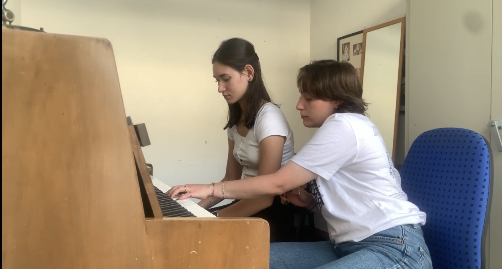

+++
title = "Informatik Projekt"
date = "2023-06-11"
draft = false
pinned = false
image = "img_0569.jpg"
+++
\
Im Zuge des Abschlussprojekt in der Informatik haben wir uns die Frage gestellt wie schwierig es ist ein Song ein song zu entwerfen, ihn aufnehmen und eine Musikvideo dazu zu schneiden.Wie haben uns also das Ziel gesetzt ein ein song komplet selber zu Produzieren.

 

** *Aufteilung***

Bei unserem Projekt hatte jede Person seine eigene Aufgabe. Danae hat den Dong geschrieben, Danielle klaviergespielt und Juliette das Musikvideo für den Song gestaltet. Durch das Aufteilen des Projekts ging auch das zusammenarbeiten einfacher da wir genau wussten was machen.

***Entwicklung Prozess***

Nach dem Danae den Song geschrieben ging es daran den Song aufzunehmen. Das war wahrscheinlich der schwierigste Teil unseres Projekts, da alles bei der Aufnahme perfekt sein muss. wärnd dem Danae und Danielle den Song aufgenommen haben hat Juliette gefilmt damit man im Musikvideo sehen kann wie das der Song entstanden ist.

***Probleme***

Juliette und Danielle haben noch ein Rap teil vorbereitet, um ihn in Danaes Song zu schneiden, da wir es eine lustige Idee faden, wenn alle mal im Song vorkamen. Das Problem aber war dann das der beat der Rap teil nicht ganz mit dem Song aufging. Wir haben uns dann entschieden den Rap teil weg zu lassen da es nicht schön klinkte. Das Nächste Mal wenn wir ein Song schreiben würden wir bevor wir den Rap teil schreiben genauer hinschauen welcher Beat wir brauchen.

***Fazit***

Ein Song zu schreiben, braucht viel Zeit und Geduld. Es ist aber etwas das wir alle gern machen daher stecken wir auch gerne Zeit rein. Da es das erste Mal für uns war ein Song zusammen zu produzieren ging alles ein bisschen Läger und es gab auch ein paar Probleme, aber das nächste Mal würde das ganze Projekt schon schnelle gehen da wir uns schon besser auskennen würden.